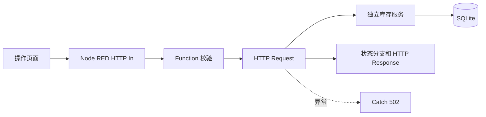

# 实验 6 物资领用工作流系统

Node-RED 5.0.7 负责编排，独立 Node.js SQLite 服务负责库存事务、幂等和规则版本。作者：侯宇晴，学号 23120506154，软件2304。

## 功能

- 订单表单、商品服务端库存、提交进度、记录列表、状态筛选和详情。
- 10 种商品，覆盖充足、低库存和零库存。
- SQLite 持久化；库存扣减和预留记录在同一事务。
- request_id 幂等：相同请求重放不扣减，不同请求体复用编号返回 409。
- 区分参数错误、未知商品、领用上限、缺货和依赖故障。
- 自主功能：每个商品有可配置领用上限，结果记录 `rule_version=2026.1`。



## 环境和安装

- Node.js 22.9 以上，本机验证 22.14.0
- Node-RED 固定 5.0.7
- 无需 Docker、云账号或收费 API

```powershell
npm ci --cache .npm-cache
.\scripts\start.ps1
```

访问操作页面 `http://127.0.0.1:1880/orders`，编辑器仅绑定回环地址并位于 `/editor`，库存服务位于 `http://127.0.0.1:8001`。停止命令：

```powershell
.\scripts\stop.ps1
```

Node-RED 使用独立 `data/node-red` userDir，文件 Context 只保存流程上下文；业务一致性依靠库存服务 SQLite 事务。数据库文件和 Context 运行数据不进入 Git，删除 `data/inventory.db` 后重新启动即可从种子重建。

## Demo

1. 提交 `demo-0001 / BOOK / 2`，应完成且库存从 20 变为 18。
2. 重复提交相同内容，响应含 `idempotent_replay=true`，库存仍为 18。
3. 用 `demo-0001 / BOOK / 3` 提交，返回 `request_id_conflict`。
4. 提交 `HEADSET / 1` 验证缺货；提交 `BOOK / 6` 验证规则上限。
5. 在记录列表筛选 `rejected` 并打开详情。

## 测试

```powershell
npm test
```

当前结果：25 项全部通过。接口说明见 `docs/API.md`，测试证据见 `docs/TESTING.md`。

## 数据所有权和限制

页面不决定库存和规则；Node-RED 不访问数据库；库存服务拥有唯一事实。SQLite 适合本地单机实验，不代表跨服务分布式事务。未启用自动重试，因为超时意味着结果未知，应先按编号查询。编辑器不应暴露到公网；生产部署还需要认证、TLS、审计和备份。

## 开源和个人实现

上游 Node-RED 提供通用编排节点和运行时。本人实现商品模型、事务、幂等、规则、页面、流程业务逻辑、异常策略和测试。许可证与来源见 `NOTICE.md`。开发分支为 `feature/order-workflow`，Issue、PR 和自审记录保存个人开发证据。

